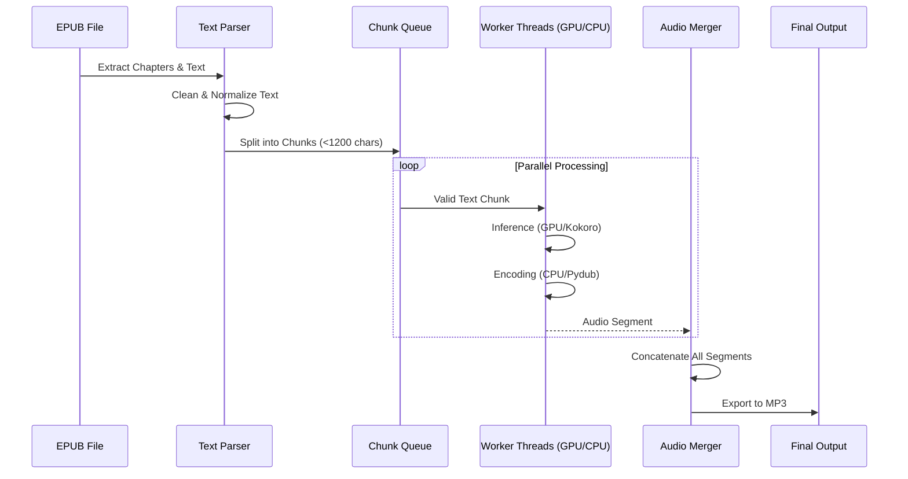

# Project Architecture

This document describes the technical structure and architecture of the AI Audiobook generator.

## System Overview

The project consists of two main components:
1.  **Frontend CLI**: A Node.js/TypeScript application providing a rich terminal user interface (TUI).
2.  **Backend Core**: A Python script (`app.py`) that handles the heavy lifting of EPUB parsing and Text-to-Speech (TTS) generation using the Kokoro model.

The CLI acts as a controller, spawning the Python process and visualizing its progress in real-time.

## Directory Structure
```
ai_audiobook_fast/
├── app.py                  # Core Python backend script
├── cli/                    # Frontend CLI Application
│   ├── src/                # Source code
│   │   ├── utils/          # Utilities (e.g., tts-runner)
│   │   └── components/     # UI Components (React/Ink)
│   ├── package.json        # CLI dependencies
│   └── tsconfig.json       # TypeScript configuration
├── requirements.txt        # Python dependencies
└── README.md               # Project documentation
```

## System Architecture

The interaction between the CLI and the Python backend is process-based. The CLI spawns the python script and communicates via `stdout`/`stderr`.

```mermaid
graph TD
    User([User]) -->|Run Command| CLI[CLI App (Node.js)]
    CLI -->|Spawns Process| Python[Python Backend (app.py)]
    
    subgraph Frontend [Frontend Layer]
        CLI
        UI[Terminal UI (Ink)]
        Runner[TTS Runner]
        CLI --> UI
        CLI --> Runner
    end

    subgraph Backend [Backend Layer]
        Python
        Loader[EPUB Loader]
        Pipeline[Kokoro Pipeline]
        Workers[Worker Threads]
        
        Python --> Loader
        Python --> Pipeline
        Python --> Workers
    end

    Runner -->|Args & Env Vars| Python
    Python -->|Stdout: Progress/Status| Runner
    Runner -->|Update State| UI
```

## Data Flow

The data flow pipeline transforms an EPUB file into a single MP3 audio file.



## Key Components

### 1. Python Backend (`app.py`)
- **Libraries**: `kokoro` (TTS), `ebooklib` (EPUB), `pydub` (Audio), `torch`.
- **Concurrency**: Uses `threading` to run multiple workers. Each worker handles both inference (GPU-bound) and encoding (CPU-bound) for a chunk.
- **IPC**: Prints structured logs (e.g., `WORKER:0:INFER:...`) to `stdout` which the CLI parses.

### 2. CLI Frontend (`cli/`)
- **Stack**: `React`, `Ink`, `TypeScript`.
- **Responsibility**: 
    - Argument parsing.
    - Process management (spawning `app.py`).
    - Visualizing workers status and overall progress.
