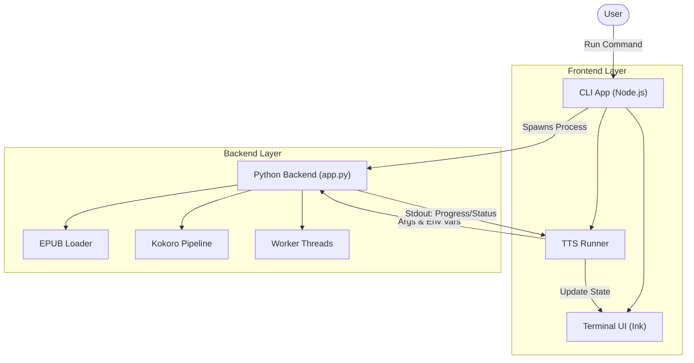
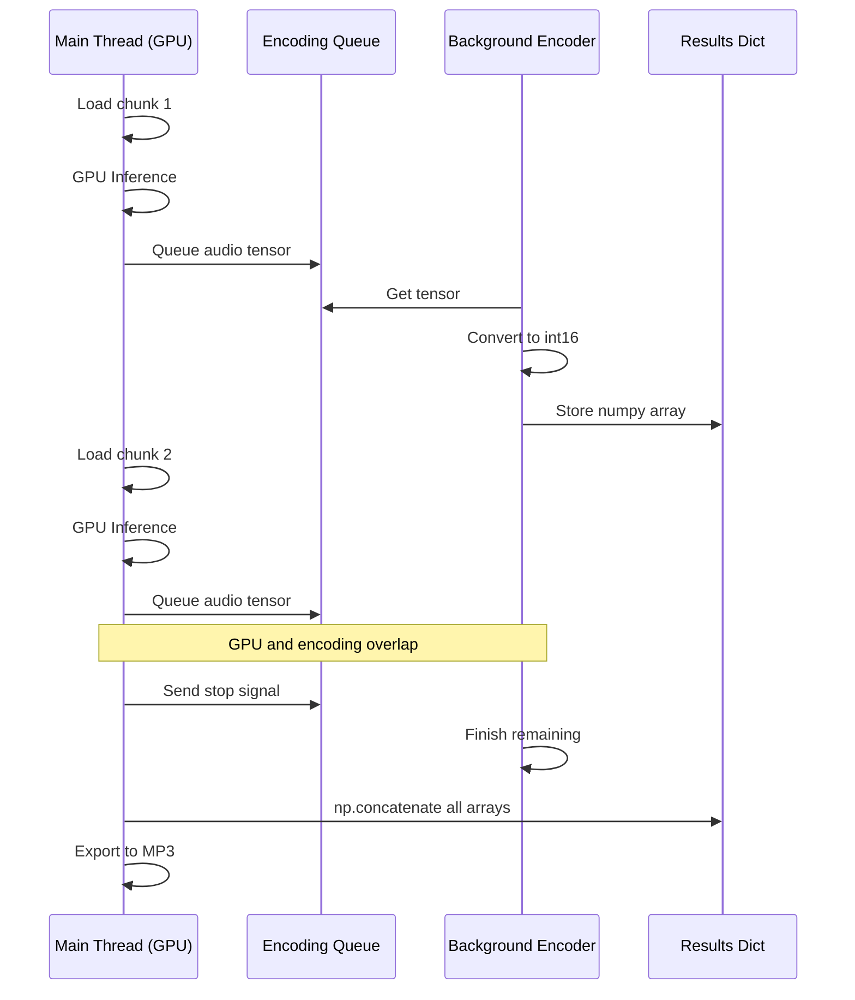
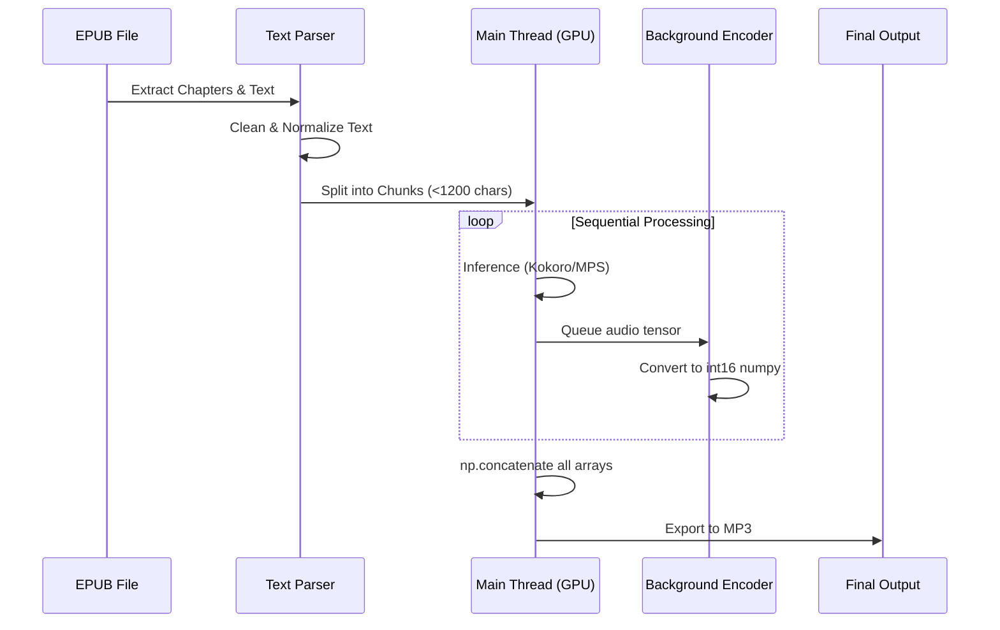

# Project Architecture

This document describes the technical structure and architecture of the AI Audiobook generator.

## System Overview

The project consists of two main components:
1.  **Frontend CLI**: A Node.js/TypeScript application providing a rich terminal user interface (TUI).
2.  **Backend Core**: A Python script (`app.py`) that handles the heavy lifting of EPUB parsing and Text-to-Speech (TTS) generation using the Kokoro model.

The CLI acts as a controller, spawning the Python process and visualizing its progress in real-time.

## Directory Structure
```
ai_audiobook_fast/
├── app.py                  # Core Python backend script
├── cli/                    # Frontend CLI Application
│   ├── src/                # Source code
│   │   ├── utils/          # Utilities (e.g., tts-runner)
│   │   └── components/     # UI Components (React/Ink)
│   ├── package.json        # CLI dependencies
│   └── tsconfig.json       # TypeScript configuration
├── requirements.txt        # Python dependencies
└── README.md               # Project documentation
```

## System Architecture

The interaction between the CLI and the Python backend is process-based. The CLI spawns the python script and communicates via `stdout`/`stderr`.



## Processing Strategy

The system uses an optimized single-threaded GPU inference model with background CPU encoding. This design was chosen because **threading provides no speedup for GPU work on Apple Silicon** — MPS serializes GPU operations, causing multiple workers to queue up waiting for GPU access.

### Architecture: Sequential GPU + Background Encoding
- **Main Thread (GPU-bound)**: Processes chunks sequentially through the Kokoro pipeline. Each audio segment is immediately queued for encoding.
- **Background Thread (CPU-bound)**: Converts raw audio tensors to int16 numpy arrays asynchronously, allowing GPU inference to continue without waiting.

### Why Not Multi-threaded GPU Workers?
Testing showed that concurrent GPU execution on MPS is actually **0.88x slower** than sequential due to:
- MPS/PyTorch GPU serialization (operations queue up anyway)
- GIL contention with multiple Python threads
- Lock overhead for thread coordination

### O(n) Audio Assembly
Previous implementations used O(n²) concatenation (`combined += segment`), which copies all data on each iteration. The optimized approach:
1. Stores raw int16 numpy arrays during processing (not AudioSegments)
2. Uses `np.concatenate(all_arrays)` at the end (single memory allocation)
3. Creates one AudioSegment from the combined numpy array

This provides ~11x speedup for the assembly phase on large books.

### Data Flow


### MPS Optimization Environment Variables
When MPS is enabled, the CLI sets these environment variables:
- `PYTORCH_ENABLE_MPS_FALLBACK=1` — Allow CPU fallback for unsupported ops
- `PYTORCH_MPS_HIGH_WATERMARK_RATIO=0.0` — Aggressive memory cleanup (helps 8GB Macs)
- `OMP_NUM_THREADS=4` — Limit OpenMP threads (reduces GIL contention)
- `OPENBLAS_NUM_THREADS=2` — Limit BLAS parallelism


## High-Level Data Flow

The data flow pipeline transforms an EPUB file into a single MP3 audio file.



## Key Components

### 1. Python Backend (`app.py`)
- **Libraries**: `kokoro` (TTS), `ebooklib` (EPUB), `pydub` (Audio), `torch`, `numpy`.
- **Concurrency**: Single-threaded GPU inference with one background encoding thread. Avoids GPU contention issues from multi-threaded approaches.
- **Optimization**: `audio_to_int16()` only moves tensors to CPU when on MPS/CUDA (avoids unnecessary transfers).
- **IPC**: Prints structured logs (e.g., `WORKER:0:INFER:...`, `PROGRESS:N/M chunks`) to `stdout` which the CLI parses.

### 2. CLI Frontend (`cli/`)
- **Stack**: `React`, `Ink`, `TypeScript`.
- **Responsibility**:
    - Argument parsing and configuration UI.
    - Process management (spawning `app.py` with MPS environment variables).
    - Visualizing processing status and overall progress.
    - Bounded stderr buffer (10KB max) to prevent memory leaks on long runs.
